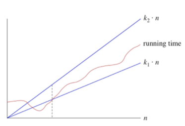
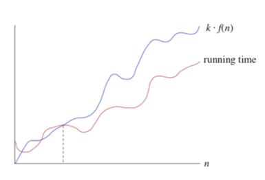
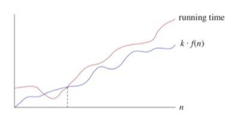

# 칸 아카데미 알고리즘 강좌 정리

[https://ko.khanacademy.org/computing/computer-science/algorithms](https://ko.khanacademy.org/computing/computer-science/algorithms)

## 숫자 맞추기

### 방법 1: 선형 검색(linear search)

- 차례대로 검색
- 확실하지만 추측 횟수가 너무 많음 
- 전체 개수가 n일 때, 최대 n 추측, 평균 추측 수 n/2

### 방법 2: 이진 검색(binary search)

- 후보 범위를 하나로 좁힐 때까지 찾고자 하는 항목을 포함하고 있는 리스트를 반으로 나누는 과정을 계속 반복함
- 순차적인 항목 리스트에서 원하는 항목을 찾기에 효율적임
- 가장 많이 사용하는 경우는 배열에서 어떤 항목을 찾을 때

## 길 찾기 문제

### 해결방법

1. 목표 네모에서 시작. 목표 지점에서 목표 지점까지는 0단계가 걸리므로 목표 지점에 숫자 0 표시
2. 미로에서 목표 지점에서 정확히 1단계 멀리있는 모든 네모를 찾아서 숫자 1이라고 표시
3. 목표 지점에서 정확히 2단계 떨어져 있는 모든 네모를 찾음. 이 네모들은 1로 표시했던 네모에서 1단계 떨어져 있고, 아직 표시되지 않은 네모임. 이 네모들을 숫자 2로 표시
4. 목표 지점에서 정확히 3단계 떨어져 있는 모든 네모를 찾음. 이 네모들은 2로 표시했던 네모에서 1단계 떨어져 있고, 아직 표시되지 않은 네모임. 이 네모들을 숫자 3로 표시
5. 이런 식으로 목표 지점에서 거리가 커지는 순서대로 미로 안의 네모들을 계속 표시. 숫자 k로 네모를 표시한 후 k로 표시된 네모들에서 한 단계 멀리 있고 아직 표시가 되어 있지 않은 모든 네모들을 숫자 k+1라고 표시함
6. 출발 지점에 네모를 표시하는 순간이 옴. 그러면 출발 지점에서 경로를 따라 네모의 숫자가 항상 줄어드는 방향으로 네모들을 선택하여 목표 지점으로의 경로를 찾아냄

## 이진 검색 

### 의사코드(pseudocode)

1.  min=0, max=n-1
2. guess=min와 max의 평균값(정수이므로 내림)
3. 만약 array[guess]가 target이라면 끝. return guess
4. 만약 array[guess]<target이면 min=guess+1
5. 만약 array[guess]>target이면 max=guess-1
6. 2번으로 돌아감

### array에 target이 없는 경우를 고려하는 의사코드

1. min=0, max=n-1
2. 만약 max<min이면 멈춤. target는 array에 존재하지 않는 것임. return -1
3. guess=min와 max의 평균값(정수이므로 내림)
4. 만약 array[guess]가 target이라면 끝. return guess
5. 만약 array[guess]<target이면 min=guess+1
6. 만약 array[guess]>target이면 max=guess-1
7. 2번으로 돌아감

### javascript 코드

```js
/* Returns either the index of the location in the array,
  or -1 if the array did not contain the targetValue */
var doSearch = function(array, targetValue) {
	var min = 0;
	var max = array.length - 1;
    var guess;
    var count = 0;
    
    while(min <= max) {
        count++;
		guess = Math.floor((min + max) / 2);
		println("guess is " + guess);
		if(array[guess] === targetValue) {
		    println("count is " + count);
			return guess;
		} else if(array[guess] < targetValue) {
			min = guess + 1;
		} else {
			max = guess - 1;
		}
	}

	return -1;
};

var primes = [2, 3, 5, 7, 11, 13, 17, 19, 23, 29, 31, 37, 
		41, 43, 47, 53, 59, 61, 67, 71, 73, 79, 83, 89, 97];

var result = doSearch(primes, 73);
println("Found prime at index " + result);

Program.assertEqual(doSearch(primes, 73), 20);
Program.assertEqual(doSearch(primes, 61), 17);
Program.assertEqual(doSearch(primes, 4), -1);
```

### 이진 검색 실행 횟수

길이가 n인 배열: n개의 값부터 시작해 1개만 남을떄까지 범위를 반으로 줄여나간 횟수에 1을 더한 횟수 
=> (2를 밑으로 하는 n의 로그) + 1

## 점근적 표기법(asymptotic notation)

### 알고리즘 실행 시간

1. 입력값의 크기에 따른 알고리즘의 실행 시간
2. 실행 시간의 성장률(rate of growth): 입력값의 크기에 따라 이 함수가 얼마나 빨리 커지는지

중요하지 않은 항목과 상수 계수를 제거하여 알고리즘 실행 시간에서 중요한 부분인 성장률에 집중할 수 있음

### Big-θ (빅 세타) 표기법

**Θ(n)**



- 실행시간을 표시하기 위해 사용하는 표기법
- 실행 시간이 커지는 것을 일정 하한선과 상한선 내에서 점근적으로 제한하기 위해 사용
- 특정 실행 시간이 Θ(n)이라고 하는 것은 n이 충분히 크다면 실행 시간이 어떤 상수 k1와 k2에 대하여 최소 k1\*n이며 최대 k2\*n가 된다는 뜻 (n의 작은 값에 대해서는 고려하지 않음)
- n값이 충분히 커지면 점선에서 오른쪽 실행 시간은 반드시 k1\*n와 최대 k2\*n 사이에 있음. k1와 k2라는 상수가 있다면 실행 시간은 Θ(n)이라 할 수 있음
- 시간 단위를 고려할 필요가 없음
- 실행 시간에 대해 점근적으로 근접한 한계값이 있다고 표현하는 것(위아래로 상수값 내에서 실행 시간을 좁힐 수 있다는 뜻)

### 점근적 표기법 형태의 함수

1. n0 = 1 일 때, Θ(n0)라고 안쓰고 Θ(1)이라 씀
2. Θ(log10-n) 시간은 Θ(lg-n) 시간이 걸린다고 할 수 있음
	- 로그의 밑이 상수라면 점근적 표기법에서 어떤 밑 값을 사용하는지 상관없음
	- loga-n = logb-n / logb-a 라는 공식 때문
3. a<b라면 Θ(n^a)의 실행 시간은 Θ(n^b)의 실행 시간보다 천천히 커짐
4. 알고리즘 분석 시 자주 쓰이는 점근적 표기법의 함수(커지는 속도가 느린 것부터 빠른 순서대로)
	1. Θ(1)
	2. Θ(lg-n)
	3. Θ(n)
	4. Θ(nlg-n)
	5. Θ(n^2)
	6. Θ(n^2lg-n)
	7. Θ(n^3)
	8. Θ(2^n)

### Big-O 표기법(점근적 상한선)

**O(n)**



- 실행 시간이 커지는 것을 일정 상한선 내에서만 점근적으로 제한하기 위해 사용
- 실행 시간은 최대한 이만큼 커지지만 더 천천히 커질 수도 있음을 의미
- 실행 시간이 O(f(n))이라면 충분히 큰 값인 n에 대해 실행 시간은 어떤 상수값 k에서 최대 k*f(n)가 됨

### Big-θ와 Big-O

- 어떤 경우에는 실행 시간이 Θ(f(n))이라고 말한다면 이는 또한 O(f(n))이기도 함. 역은 항상 참이 아님
- rate of growth가 더 큰 점근적 상한선이 올바르다고 말할 수는 있지만 덜 정확함. Big-θ는 올바른 표현이 될 수 없음

### Big-Ω 표기법(점근적 하한선)

**Ω(n)**



- 알고리즘이 상한선 없이 최소한 어느 정도 걸린다고 해야할 때 사용
- 실행 시간이 Ω(f(n))라면 n이 충분히 클 때 실행 시간은 어떤 상수 k에 대해 최소 k*f(n)임
- Θ(f(n))가 자동적으로 O(f(n))를 의미하는 것과 마찬가지로 Ω(f(n)도 의미함
- 정확하진 않지만 모든 실행 시간이 Ω(1)이라 말할 수 있음

## 정렬

### swap 함수

```js
var swap = function(array, firstIndex, secondIndex) {
    var temp = array[firstIndex];
	array[firstIndex] = array[secondIndex];
	array[secondIndex] = temp;
};

var testArray = [7, 9, 4];
swap(testArray, 0, 1);

println(testArray);

Program.assertEqual(testArray, [9, 7, 4]);
```

### 선택 정렬 의사코드

1. 가장 작은 카드를 찾아 첫 번째 카드와 바꿈
2. 두 번째로 작은 카드를 찾아 두 번째 카드와 바꿈
3. 세 번째로 작은 카드를 찾아 세 번째 카드와 바꿈
4. 배열이 정렬이 다 될때까지 계속 다음으로 작은 카드를 찾아서 정확한 위치로 옮김

### 하위 배열에서 최솟값 찾기

```js
var indexOfMinimum = function(array, startIndex) {
    var minValue = array[startIndex];
    var minIndex = startIndex;

    for(var i=minIndex+1; i<array.length; i++) {
     if(array[i] < minValue) {
         minValue = array[i];
         minIndex = i;
     }
    }
    
    return minIndex;
}; 

var array = [18, 6, 66, 44, 9, 22, 14];   
var index = indexOfMinimum(array, 2);

println("The index of the minimum value of the subarray starting at index 2 is " + index + "."  );
Program.assertEqual(index, 4);
```

## 선택 정렬 구현

```js
var swap = function(array, firstIndex, secondIndex) {
    var temp = array[firstIndex];
    array[firstIndex] = array[secondIndex];
    array[secondIndex] = temp;
};

var indexOfMinimum = function(array, startIndex) {

    var minValue = array[startIndex];
    var minIndex = startIndex;

    for(var i = minIndex + 1; i < array.length; i++) {
        if(array[i] < minValue) {
            minIndex = i;
            minValue = array[i];
        }
    } 
    return minIndex;
}; 

var selectionSort = function(array) {
    for(var i=0; i<array.length-1; i++) {
        var swapIndex = 0;
        swapIndex = indexOfMinimum(array, i);
    swap(array, i, swapIndex);
    }
};

var array = [22, 11, 99, 88, 9, 7, 42];
selectionSort(array);
println("Array after sorting:  " + array);

Program.assertEqual(array, [7, 9, 11, 22, 42, 88, 99]);
```

### 1부터 n까지 수의 합 계산 - 등차급수


1. 가장 작은 수와 가장 큰 수끼리 짝지어 더함
2. 짝지은 수의 개수만큼 곱해줌
3. 홀수 개수라면 홀로 남은 수는 한쌍의 반으로 취급하며 계산함

1. 수가 총 n개 만큼 있을 때 가장 작은 수와 가장 큰 수의 합은 n+1
2. n/2개의 쌍
3. 따라서 1부터 n까지 수의 합운 (n+1)(n/2)로 나타냄
4. 바꿔 쓰면 (n^2+n)/2

### 선택 정렬에 대한 점근적 실행 시간 

선택 정렬에 소요되는 총 실행 시간

1. 모든 indexOfMinimum 호출에 대한 실행 시간 - 루프가 n번 만큼 반복되며 그 다음부터는 n-1, n-2... 이렇게 줄어드는 등차급수며 (n^2+n)/2로 나타낼 수 있음: Θ(n^2)
2. 모든 swap 호출에 대한 실행 시간 - n번 만큼 호출되고 때마다 같은 시간 소요: Θ(n)
3. selectionSort 함수 내 남아있는 다른 모든 루프의 실행시간: Θ(n)

이 셋 중 Θ(n^2)이 가장 유효한 항이므로 선택 정렬의 실행시간은 Θ(n^2)으로 정의할 수 있음

## 삽입 정렬

### insert 구현

```js
var insert = function(array, rightIndex, value) {
  var index;
  for(index=rightIndex; index>=0 && array[index]>value; index--) {
    array[index+1] = array[index];   
  }
  array[index+1] = value;
};

var array = [3, 5, 7, 11, 13, 2, 9, 6];

insert(array, 4, 2);
println("Array after inserting 2:  " + array);
Program.assertEqual(array, [2, 3, 5, 7, 11, 13, 9, 6]);

insert(array, 5, 9);
println("Array after inserting 9:  " + array);
Program.assertEqual(array, [2, 3, 5, 7, 9, 11, 13, 6]);

insert(array, 6, 6);
println("Array after inserting 6:  " + array);
Program.assertEqual(array, [2, 3, 5, 6, 7, 9, 11, 13]);
```

+) for문의 조건에 index>=0를 뒤쪽에다 넣어서 한참 고생했음 ㅠㅠ

### 삽입 정렬 의사코드

1. insert를 호출하여 인덱스 0의 정렬된 하위 배열에 인덱스 1부터 시작하는 요소를 삽입
2. insert를 호출하여 인덱스 0에서 1까지 정렬된 하위 배열에 인덱스 2부터 시작하는 요소를 삽입
3. ...
4. 마지막으로 insert를 호출하여 인덱스 0에서 n-2까지 정렬된 하위 배열에 인덱스 n-1부터 시작하는 요소를 삽입

### 삽입 정렬 구현

```js
var insert = function(array, rightIndex, value) {
  var index;
  for(index=rightIndex; index>=0 && array[index]>value; index--) {
    array[index+1] = array[index];   
  }
  array[index+1] = value;
};

var insertionSort = function(array) {
    for(var i=1; i<array.length; i++) {
     insert(array, i-1, array[i]);   
    }
};

var array = [22, 11, 99, 88, 9, 7, 42];
insertionSort(array);
println("Array after sorting:  " + array);
Program.assertEqual(array, [7, 9, 11, 22, 42, 88, 99]);

var array = [-1, 0, 22, 11, 99, 88, 9, 7, 42];
insertionSort(array);
println("Array after sorting:  " + array);
Program.assertEqual(array, [-1, 0, 7, 9, 11, 22, 42, 88, 99]);
```

### 삽입 정렬 분석

1. 인덱스 1, 2, 3, ... , n-1 요소에서 c줄이 필요한 insert를 호출
2. 삽입하려는 값이 하위 배열의 모든 요소들보다 작다고 가정하면 실행 시간은 총 c*1 + c*2 + ... + c*(n-1) = c*(1+2+...+(n-1)) 임
3. 이를 수학 공식을 이용해 정리하면 (cn^2-cn)/2
4. Big-Θ 표기법을 사용하면 삽입 정렬의 실행 시간은 Θ(n^2)임
5. 삽입하려는 값이 하위 배열 내의 모든 요소보다 클 경우 삽입 정렬의 실행 시간은 c*(n-1)이며 이는 Θ(n)임

앞처럼 모든 요소가 한 칸씩 밀리는 경우(삽입 정렬의 실행 시간이 Θ(n^2)인 경우)는 배열이 역순으로 정렬되어 있다는 뜻

반대의 경우(삽입 정렬의 실행 시간이 Θ(n)인 경우)는 배열이 미이 정렬되어 있다는 뜻

정리
- 최악의 경우: Θ(n^2)
- 최상의 경우: Θ(n)
- 임의의 배열에 대한 평균적 경우: Θ(n^2)
- 거의 정렬된 경우: Θ(n)